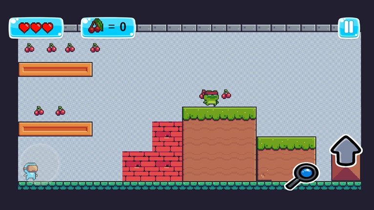
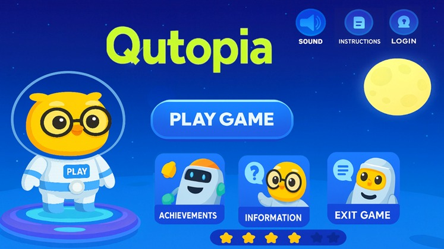
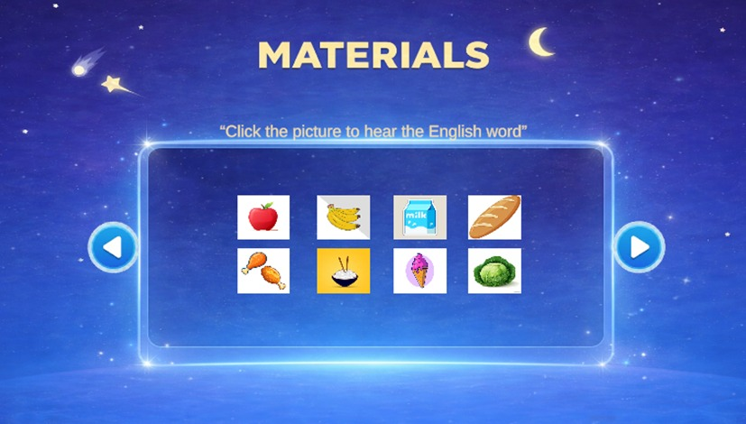
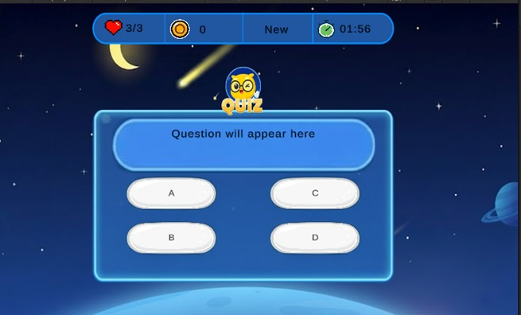

# 🎮 Qutopia

> ⚡ **Playable in browser — no download required.**  
> https://ikhssan.itch.io/qutopia

Qutopia is a lightweight 2D game built with Unity that focuses on simple mechanics, interactive learning, and smooth gameplay.  
This project demonstrates my ability to design and develop a fully playable game experience from concept to deployment.

---

## 🖼️ Gameplay Preview

### 🎯 Gameplay

### 🏠 Main Menu

### 📚 Learning Materials

### ❓ Quiz System

---

## 📌 About The Project

Qutopia combines casual gameplay with educational elements while maintaining lightweight performance and clean structure.

Through this project, I applied practical game development skills including:

- Gameplay programming  
- Scene management  
- UI implementation  
- Asset integration  
- Designing simple and intuitive mechanics  

---

## 🛠️ Tech Stack

- Unity  
- C#  
- 2D Game Development  
- Git & Version Control  

---

## 🎯 Skills Demonstrated

✅ Building a complete playable game  
✅ Integrating prepared assets into working systems  
✅ Creating structured UI and scenes  
✅ Delivering a browser-playable build  
✅ Maintaining organized project architecture  

---

## 🚀 Project Status

Playable demo available and fully functional.

---

## 👨‍💻 Developer

**Ikhsan Khaeruddin**  
Game Developer | Unity Developer
